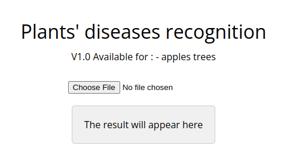

# aicg-week2-leafs2
Classify plants' diseases with your camera

## Goals
I realized this project as a part of the AICG course week2 from the IFT program. I had to program a computer vision model - to classify images.

The instructions were to render a web page - to show the possibilities of our model - using cnn and mlp as a neural network for the computer vision  model.

--------

## Project Structure

The project is organized as follows:

- `train.py` file containing all the necessities totrain/fit the model - I used fine-tunning with ResNET to get a proper and powerful cnn - then a mlp with only one fully connected layer. THE model is exported to a .pt and a .onnx file
- `precision_test.py` file containing a script to test the model - and get a precision number.
- `dataset` folder containing images to train the model and dataframe to store the class of these images - this dataset comme from this kaggle contest : https://www.kaggle.com/competitions/plant-pathology-2020-fgvc7/overview

## Usage
This program is running on a web page hosted by github

1.  Go to : https://arthurszantyr.github.io/aicg-week2-leafs2/

  

2.  Click on "Choose File" and select a JPEG image file - showing a plant leaf

__additional feature on smartphone__
    
    you can directly take a picture instead of selecting a file

3. The model will analyze the image - and return the disease or not of your tree

  

